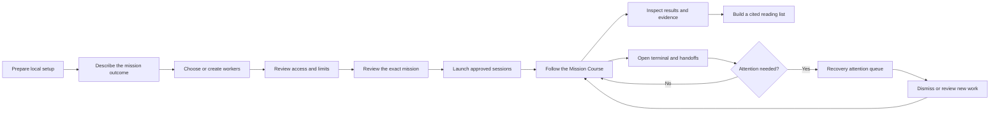

# ThreadHelm Journey UI: From Prototyping to Production

**Status:** Phases 1, 2 and 4a shipped (Mission Course, shell fixes, guided mission composer). Phase 3 (terminal dock), 4b (coach generation), 5 (secondary destinations) and 6 (legacy stylesheet retirement) remain.

**Decision window:** 2026-08-31 through 2026-09-02

**Production integration:** PR #18, merged as `12754f1`

## Purpose

This document records how ThreadHelm's Journey UI moved from disposable browser comparisons to the
production desktop workspace. It connects the selected prototype directions, the user journey they
create, and the production surfaces that now implement them.

Prototype files were comparison tools. They contained representative local data and no production
coordination calls. The selected ideas were rebuilt against validated renderer contracts, verified,
and then the prototype directory was removed from the production tree.

## Journey at a glance

The journey is continuous, but each consequential transition retains an explicit review boundary.
Coaching reduces form work and explains choices; it never approves folders, grants authority,
publishes memory, resends unknown work, or launches a provider without the required user action.

## Prototype-to-production decisions

| Journey area     | Prototype direction selected                                                                  | Production outcome                                                                                                                                                    |
| ---------------- | --------------------------------------------------------------------------------------------- | --------------------------------------------------------------------------------------------------------------------------------------------------------------------- |
| Mission home     | **D — Mission Course**, combining the mission queue and context rail with an outcome timeline | One selected mission owns the main workspace, course, evidence, attention, crew, and attached sessions                                                                |
| Mission creation | Continuous guided flow with outcome, crew, access and limits, and exact review coaching       | Four-stage guided composer with main-owned autosave drafts, per-worker assignment and return evidence, and four Review states. Coach generation deferred to phase 4b. |
| Sessions         | **B — Mission dock**, with lifecycle evidence from the inspector direction                    | Mission-scoped session tabs, exact-target controls, persistent terminal buffers, handoffs, conversations, and recovery evidence                                       |
| Agents           | **C — Guided library with Profile Studio detail**                                             | Generic starters, local profile creation, exact JSON import, profile goal and abilities, provenance, compatibility, and revisions                                     |
| Memory           | **B — Search-led Reading Desk and Librarian**, plus **C — mission context packs**             | Exact local search, cited volume detail, Librarian guidance, and a bounded mission reading list                                                                       |
| Setup            | **C — Task-oriented guided setup**, plus **B — compact attention summary**                    | Three explained checks for workspace access, provider readiness, and application evidence                                                                             |
| Recovery         | **C — Cross-mission attention queue**, plus **B — mission-context detail**                    | Unresolved evidence queue, exact session and workspace detail, dismissal, and reviewed replacement work                                                               |

## The production journey

### 1. Prepare ThreadHelm

The journey begins in **Guided Setup**, which answers three questions in order:

1. Which local folder has the user approved?
2. Which provider is available and ready on this machine?
3. Is the local application healthy enough to retain and coordinate the work?

ThreadHelm explains each check and displays effective local evidence. It does not sign in to a
provider or approve a folder on the user's behalf. Folder revocation, provider readiness, storage
health, local architecture, unsigned release status, and sole-writer ownership remain visible.

### 2. Describe the outcome

Mission creation begins with the result the user wants, rather than provider or runtime settings.
Coaching keeps the objective, completion evidence, and mission-specific assignments understandable
before the user chooses execution details.

Reusable profile purpose remains separate from mission work:

- A profile goal describes what that worker is generally suited to do.
- A mission assignment describes what the worker should do for this mission.
- Required return evidence describes how the user can judge the result.

This separation prevents an imported profile from silently widening a mission.

### 3. Choose or create workers

The **Agent Library** offers three paths:

- Start from a generic bundled worker.
- Open or reuse a reviewed local profile.
- Import exact local JSON or create a profile through the guided UI.

Before addition, the interface shows the worker's description, goal, abilities, provider request,
model request, provenance, and compatibility. Ability labels help with matching only; they do not
grant tools, permissions, folder access, or authority.

Generic starters remain separate from private local profiles. Personal personas are never bundled
with the production application.

### 4. Review access and limits

The journey next explains the authority the mission will actually receive. Workspace access,
provider readiness, model and effort compatibility, operating limits, stop behavior, and approval
requirements are presented as mission constraints rather than unexplained dropdowns.

Provider, model, and effort remain distinct decisions. The model choices belong to the selected
provider, and the available effort choices belong to that provider and model combination. A provider
default remains explicit instead of implying that every command-line provider shares one default.

### 5. Review the exact mission

The final review brings the journey together in one place:

- outcome and completion evidence;
- worker purpose and mission assignment;
- exact workspace and provider access;
- model, effort, and operating limits;
- ordered handoffs and expected returns;
- stop, approval, and recovery behavior;
- retained review and resolution evidence.

The coach may point out missing evidence, incompatible selections, stale approval, or unresolved
setup. It cannot silently repair those conditions or start a partial substitute crew.

### 6. Follow the Mission Course

After launch, **Mission Course** becomes the primary workspace. It distinguishes verified, current,
queued, waiting, uncertain, recovery-required, deferred, and completed work.

The screen answers four questions:

1. What outcome owns the screen?
2. What has been verified?
3. What is happening now?
4. What decision or bounded action comes next?

Selecting another mission moves the heading, course, evidence, context, and attached-session summary
together. Terminal controls from the previous mission are not left behind as stale active controls.

### 7. Work with sessions and handoffs

The **Sessions workspace** shows only sessions attached to the selected mission when mission context
is available. Each terminal identifies its provider, workspace, lifecycle state, and exact target
before accepting input.

Session tabs preserve each session's bounded terminal buffer. New-output attention stays attached to
the session that produced it. Directed handoffs retain their sender, one recipient, exact content,
delivery state, and work outcome as separate facts.

Unknown delivery is never treated as permission to resend automatically.

### 8. Find and cite evidence

The **Memory Library** uses a book and library model:

- Search finds exact local volumes and revisions.
- Opening a result shows its citation and lifecycle state.
- The Librarian explains why evidence matched and proposes useful searches.
- A mission reading list collects explicit revisions for bounded context.

The Librarian may search, explain, propose, and organize. Publishing, conflict resolution, content
deletion, and authority changes remain separate reviewed actions.

### 9. Recover without rewriting history

The **Recovery attention queue** gathers unresolved records across missions. Opening a record shows
the exact mission, session, workspace, last known state, and retained evidence.

The user may dismiss a record or review a replacement session as new work. ThreadHelm does not infer
that uncertain work failed, succeeded, or is safe to replay. Deletion reviews name what will be
removed, what receipts remain, and which active or unknown leases block confirmation.

## Continuous coach behavior

The Journey UI presents one continuous assistant voice across outcome, crew, access, review, memory,
and recovery. Its behavior follows the same contract everywhere:

| The coach may                                           | The coach may not                                              |
| ------------------------------------------------------- | -------------------------------------------------------------- |
| Explain the current step and why it matters             | Grant folder, provider, tool, or external authority            |
| Suggest clearer outcomes and evidence                   | Replace the user's selected provider silently                  |
| Propose workers from generic or reviewed local profiles | Launch, publish, delete, or resend consequential work silently |
| Identify missing setup or incompatible runtime choices  | Convert an unknown outcome into success, failure, or retry     |
| Search and organize cited local memory                  | Treat descriptive abilities as permissions                     |
| Summarize exact review evidence                         | Hide the exact target of a destructive action                  |

## Visual and interaction language

The production direction uses a calm Windows workspace rather than a themed office or control room.
Mission identity and evidence carry the hierarchy; decoration stays secondary.

- **Ink:** primary text and key action identity.
- **Fog:** application shell and supporting surfaces.
- **Paper:** the selected mission workspace.
- **Copper:** the current position and owner attention.
- **Verdigris:** verified and locally healthy states.
- **Steel blue:** evidence and operational links.

State is always expressed with text and structure as well as color. Keyboard focus follows the
journey, reduced-motion settings are respected, and terminal output is excluded from general live
region announcements.

## Prototype governance

Future Journey UI changes use the same page gate:

1. Identify the user question and required states.
2. Build two or three structurally different disposable browser variants.
3. Present those variants with representative local data and a visible prototype marker.
4. Record the selected direction and rejected behaviors.
5. Rebuild the selection as production components against validated contracts.
6. Verify keyboard, narrow-window, state, authority, and installed-app behavior.
7. Remove the prototype code before packaging.

Approval of one page does not approve another page or widen runtime authority. Fine spacing and box
alignment may be refined after the information hierarchy is selected, but required evidence,
identity, accessibility, and safety states are part of the prototype decision and cannot be deferred
as visual polish.

## Production mapping

| Journey surface              | Production location                                                          |
| ---------------------------- | ---------------------------------------------------------------------------- |
| Application composition      | `apps/desktop/src/renderer/App.tsx`                                          |
| Mission Course               | `apps/desktop/src/renderer/features/mission-focus/`                          |
| Guided Setup                 | `apps/desktop/src/renderer/features/workspaces/GuidedSetup.tsx`              |
| Agent Library                | `apps/desktop/src/renderer/features/coordination/AgentLibraryWorkspace.tsx`  |
| Memory Library and Librarian | `apps/desktop/src/renderer/features/coordination/MemoryLibraryWorkspace.tsx` |
| Sessions and terminal dock   | `apps/desktop/src/renderer/features/sessions/SessionWorkspace.tsx`           |
| Recovery attention queue     | `apps/desktop/src/renderer/features/recovery/RecoveryAttentionQueue.tsx`     |
| Page decisions               | `docs/architecture/mission-focus-page-decisions.md`                          |
| Workspace design             | `docs/architecture/mission-focus-workspace-design.md`                        |
| Selected prototype locations | `docs/architecture/journey-ui-selected-prototype-locations.md`               |

The merged production renderer contains no prototype runtime path. The prototype journey remains in
this document and the decision records as design evidence rather than shipped application content.
