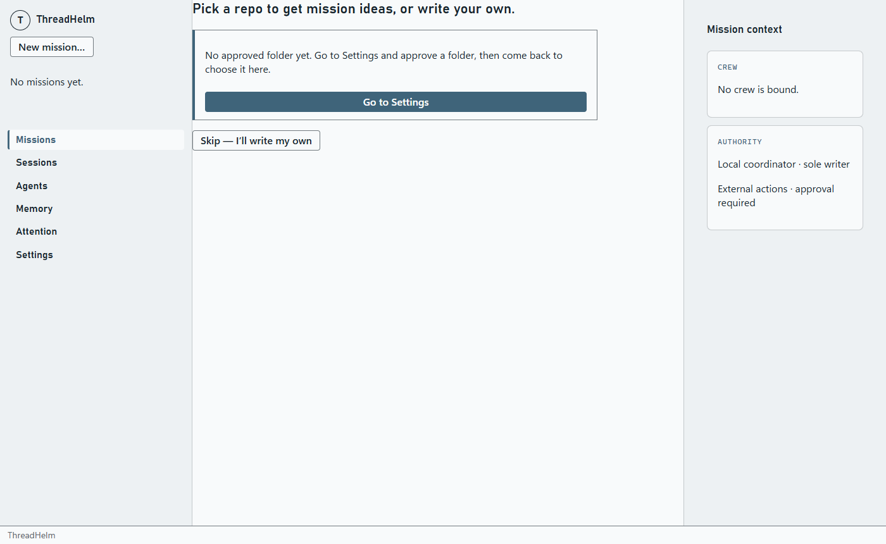

# Main merge reconciliation — PR #29

**Date:** 2026-09-05
**Original audit:** `c037c7c` — [historical Mission report](missions.md)
**Current baseline:** `8f41aae4ec65b52c4c6d7abb1c0c608fe666ec26`
**Merged change:** [PR #29 — stop horizontal scroll, collapse ended sessions, drop duplicate destination](https://github.com/Lastonedown86/ThreadHelm/pull/29), merged 2026-09-05 15:48:56 UTC.
**Environment:** Windows 11 Home, OS release `10.0.26200`, x64 Electron build; direct navigation probes at 1400 × 860.

## Outcome

PR #29 improves the common visual baseline and removes the redundant Templates destination. It does not fully resolve any of MIS-001–014. The nine audit passes remain useful, but A05 is now a nested starter/template audit within Agents. There are six global destinations: Missions, Sessions, Agents, Memory, Attention, Settings.

The new main was fetched, fast-forwarded, and built before these checks. The core composer, MissionRail, useMissionWorkspace, MissionWorkspace, MissionDetail, and mission-binding validation files are unchanged between the two baselines. App.tsx removes only the duplicate Templates destination. This establishes continued source evidence, not a fresh runtime test of every defect.

## What has already changed

| Area | Merged implementation | Impact on Feature 004 |
| --- | --- | --- |
| Destination inventory | Templates removed from navigation and destination routing; AgentStarterLibrary still embeds AgentTemplateLibrary inside Agents | Correct all current acceptance counts to six; audit templates as a related flow, do not propose restoring the duplicate destination |
| Shared visual language | Semantic colors resolve to the mission palette; common heading/body fonts, eyebrow, quiet/primary actions, stronger selected destination and hover styling | Treat these as the baseline. Review exceptions and semantic consistency rather than proposing another palette replacement |
| Responsive grids | Sessions/Attention/setup layouts use workspace-container breakpoints and flexible minimum tracks | Record as merged targeted overflow work. Broad narrow-width and 200% coverage remains required; do not assert all overflow is solved |
| Session inventory | Stopped, failed and recovery-required sessions grouped behind an ended-session disclosure; selected ended sessions force visibility | Audit collapse behavior, keyboard order, recovery discoverability and selection changes against this implementation |
| Template actions | Inspect/Duplicate made quiet; Create agent made primary | Audit remaining action hierarchy within Agents, not the old equal-weight controls |
| Recon guidance | Launch disclosure and running-state copy explain stopping the interactive session so roles can be collected | Treat the explanation as present; audit target clarity, collection feedback and the complete stop/return path |

PR #29's author reported 494 unit tests and 19 selected E2E tests passing. Those are upstream reports, not tests rerun by this feature. Fresh checks performed here are listed separately below.

## Finding-by-finding reconciliation

| ID | Current status | Evidence at refreshed baseline | Remaining improvement |
| --- | --- | --- | --- |
| MIS-001 | Open, reproduced | Both entry points tested from all six destinations; only Missions opens the requested screen | Unify global navigation with item opening |
| MIS-002 | Open, source-confirmed | App.tsx:93 selection retains composer state; :212 New mission directly changes pickingRepo without flushing; useDraft cleanup unchanged | Save-safe transition and consistent selected view |
| MIS-003 | Open, source-confirmed | CrewStage.tsx:270 runtime controls and AccessStage.tsx:94 folder picker unchanged; backend exact binding checks unchanged | Read-only existing-session summary and supported new-session alternative |
| MIS-004 | Open, source-confirmed | AccessStage.tsx:64 updates access by workspaceId but labels it per worker | Explicit shared-folder scope and supervisor visibility |
| MIS-005 | Open, visually refreshed | New palette/fonts inherited; repo entry still begins at panel edge and shows Mission context. See retained screenshot below | Consistent content inset, exit action and current-flow context |
| MIS-006 | Open, source-confirmed | RepoIdeaEntry label, input changes, retained ideas and objective/evidence-only selection unchanged | Accurate generation scope/default labels and invalidation |
| MIS-007 | Open, reproduced | Entered objective “Latest main audit draft” still renders as “Resume draft · Outcome · just now” | Meaningful draft identity, selection and management |
| MIS-008 | Open, visually refreshed | Fresh waiting-mission capture still shows Paused in the sidebar while content says Waiting for your decision | Share actionable state meaning; improved global destination styling does not change mission row semantics |
| MIS-009 | Open, reproduced | Closing the probe draft still requires Close then Close composer | Direct successful close with save feedback; retain failure decision |
| MIS-010 | Open, visually refreshed | Fresh Review capture retains Close/Back in sticky footer; Start remains in ReviewStage below disclosure. App.tsx:252 still opens detail on start | Consistent final action area and overview success landing |
| MIS-011 | Open, source-confirmed | Crew model field, hidden startup intent, and Access prerequisite notices unchanged. New quiet/primary styles affect template actions, not these choices | Reuse supported runtime selection patterns and fix-and-return navigation |
| MIS-012 | Open, source-confirmed | MissionComposerWorkspace.tsx:352 still disables Continue on the condition that would invoke invalid-field focus | Reachable correction action; existing accessibility suite does not exercise this blocked branch |
| MIS-013 | Open, source-confirmed | useMissionWorkspace preserves old detail during selection load; no direct Retry added to MissionWorkspace | Honest pending identity and actionable load failure |
| MIS-014 | Open, source-confirmed | Nested main landmarks, custom discard dialog and early navigation focus logic unchanged | Targeted landmark/dialog/focus corrections; passing selected accessibility tests is not complete coverage |

“Open” describes the inconsistency. Improvement dispositions remain proposed pending design review; no existing proposal is silently approved by this recheck.

## Fresh navigation probe results

Fixture-only draft with a meaningful objective and completion evidence; app reloaded between entry-point probes. Visible navigation confirmed exactly six destinations.

| Origin | New mission opens directly | Resume draft opens directly |
| --- | --- | --- |
| Missions | Yes | Yes |
| Sessions | No | No |
| Agents | No | No |
| Memory | No | No |
| Attention | No | No |
| Settings | No | No |

Reproduction: launch with isolated user data; create and save a draft from Missions; for each destination, activate New mission and inspect the visible workspace; reload, return to that destination, activate Resume draft and inspect again. In the five non-Missions cases, the original destination remains visible. Selecting Missions reveals the deferred request. These probes recorded existing failures; they are not passing regression tests.

## Fresh screenshot evidence

The retained image contains empty fixture state. Additional fresh captures inspected locally were `13-composer-review-ready.png` and `11-mission-waiting.png`, produced in ignored `artifacts/parity`. They are not committed because they include machine-specific temporary paths. Recapture using the existing parity workflow when needed; do not treat an absent local image as reviewed in another checkout.

## Additional audit coverage prompted by the merge

These are review targets, not fully audited or approved fixes:

- **A03 selected-ended disclosure:** SessionList.tsx derives `endedShown` from either the toggle or an ended selection. When an ended session is selected, “Hide N ended sessions” can remain expanded after activation. Audit the actual behavior and whether the action should explain why it cannot collapse, change selection explicitly, or offer another consistent interaction.
- **A03/A07 recovery visibility:** Recovery-required sessions now count as ended. Verify that an unresolved recovery remains discoverable from Attention and that the ended group does not imply completed recovery.
- **A04/A05 nested starter discovery:** Confirm users can find generic starters, saved drafts, imported templates, local profiles and Profile Studio through Agents without the removed destination.
- **A08 recon completion:** Verify the new guidance names the session to stop and that collection progress/failure is visible after stopping. No provider-backed recon run was initiated here.

## Verification and limits

- `git fetch --prune origin`: current main refreshed; PR #29 is the only merge since the original baseline at this check.
- `pnpm desktop:build`: passed on the refreshed baseline.
- With `PARITY_SHOTS=1`, `pnpm exec playwright test tests/e2e/parity-screenshots.spec.ts tests/e2e/accessibility.spec.ts`: **7 passed, 1.2 minutes**. Includes six existing accessibility tests and the screenshot capture workflow.
- Direct isolated probes: six-destination inventory; New mission and Resume draft navigation; draft identity; two-step successful close. Results above.
- Source delta reviewed for all MIS findings. Fresh screenshots visually inspected for entry, Review and decision-state mission.
- These tests use fixtures. No paid/external agent run, real user mission mutation, application code change or release promotion was performed.
- Full unit/contract/integration/E2E suites were not rerun for this documentation PR. Remaining section audits, design approval and Feature 002/003 gates stay open.

## Functional coverage clarification

The owner subsequently required explicit logic and functionality observation in every audit. This reconciliation proves only the scoped observations listed above. It does not establish end-to-end saved-value persistence, live-session reconfiguration rejection, shared-access effects, interrupted-save safety, or final mission start/recovery effects. Those remain pending under the new US7 / FR-016–019 action matrix.
